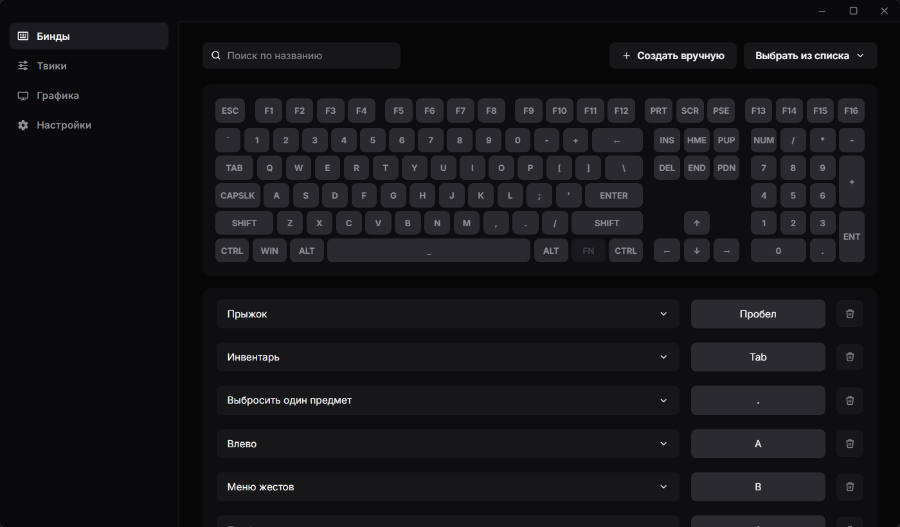

# RustTemper

<div align="center">

[](https://github.com/elev1e1nSure/rust-temper/actions/workflows/ci.yml)
[](https://github.com/elev1e1nSure/rust-temper/releases)
[](./LICENSE)
[](https://tauri.app)



[](https://github.com/elev1e1nSure/rust-temper/releases/latest)

</div>

GUI-утилита для тонкой настройки конфигурационных файлов игры Rust.
Без правки блокнотом, без гайдов на форумах. Все популярные твики и бинды —
в одном окне.

## Возможности

**Бинды** — просмотр и правка `keys.cfg` через интерактивную раскладку
клавиатуры. Поиск по клавишам и командам, встроенный словарь команд Rust,
подсветка конфликтов.

**Твики** — быстрые переключатели для `client.cfg`: FPS-оптимизации,
скрытие интерфейса, настройки оружия, шаблоны развертывания и другие
параметры. Каждый твик запоминает исходное значение для корректного отката.

**Графика** — слайдеры качества по категориям: тени, текстуры, вода,
освещение, трава, облака, сглаживание. Каждый уровень задаёт набор
предустановленных значений.

**Настройки** — автоопределение папки игры через реестр Steam, ручной
выбор каталога.

## Установка (из исходников)

```bash
git clone https://github.com/elev1e1nSure/rust-temper.git
cd rust-temper
pnpm install
pnpm tauri build
```

## Использование

```bash
pnpm install
pnpm tauri dev
```

При первом запуске утилита попытается найти папку с игрой автоматически.
Если автоопределение не сработало — укажите путь вручную на странице
настроек.

## Стек

- **Frontend**: React 19, TypeScript 5.8, Vite 7, @mingcute/react
- **Backend**: Rust, Tauri 2, serde
- **Tooling**: pnpm, ESLint (flat config), Prettier, cargo clippy, rustfmt
- **CI/CD**: GitHub Actions (check на каждом пуше, сборка релиза по тегу `v*`)

## Лицензия

[GPL-3.0](./LICENSE)
